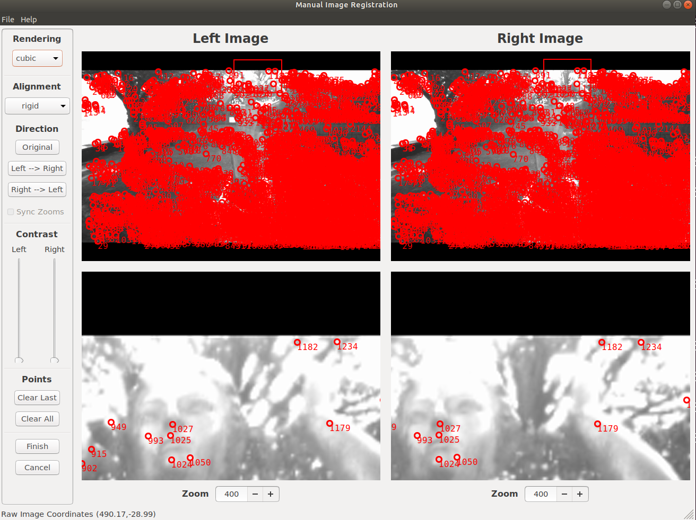

# Micmac tools in photogrammetry
Micmac [^1] 是一个摄影测量的开源工具，是基于C++的，可以在Windows和Linux/MacOS X 上运行，由于开发的人主要是Ubuntu，建议在Ubuntu下用。

Micmac的功能与Colmap[^2] 类似，但是在处理卫星影像数据时，优势是很大的。虽然也有把卫星影像转成Colmap可以处理的类型 [^3]，Micmac的功能更全，包括Crop、RPC的转换等。

## build(编译)

建议在Ubuntu下编译[^4]，基本不会有配置、运行、编译等错误。

``` shell
git clone https://github.com/micmacIGN/micmac.git
cd micmac/
mkdir build
cd build
cmake -DWITH_QT5=1 -DWITH_CPP11=1 ..
make install -j4
sudo gedit /etc/bash.bashrc
export PATH=/micmac_install_directory/micmac/bin:$PATH
```

## Aerial image(航空影像)

这里的航空影像是指的框幅影像或者叫小孔成像[^5]，对于普通的相机拍摄的都可以处理。之前Github [^6]上已经写了一个详细的流程可以参考。

在Ubuntu下面显示界面很少， 不过Micmac中有一些显示工具，可以显示影像和输出的结果。

### Vino

Vino是显示影像的模块：

``` shell
Vino Crop-IMG_PHR1B.tif
```

### 显示Feature point

可以用SEL这个工具显示：

``` shell
SEL ./ im0.png im1.png KH=NT
```

写有基于python与wxpython[^9]的工具，是基于keypointgui [^10]开发的，可以支持Micmac的文本和二进制格式  [^11] ：



### 显示Epipolar

核线影像是否没有上下视差受影像的姿态精度决定的，也影响后面密集匹配的结果。

写有一个基于C++与QT的工具 [^8]，可以显示红/绿映像：


### 显示空三结果

最后显示结果可以用AperiCloud输出结果：

``` shell
AperiCloud ".*tif" Ori-Compense
```

## Satellite image(卫星影像)

对于卫星影像，由于很多用RPC作为参数，因此和航空影像的处理有一些区别，有一个详细的流程介绍了卫星影像的处理 [^7] 。

卫星影像处理除了参数与航空影像不一样之外，内部的原理其实是一致的，因此显示工具基本是可以通用的。

### Crop

Crop是一个很好的工具，当我们要处理一部分数据，可以减少处理时间，可以用命令：


``` shell
mm3d SateLib CropRPC Ori-satRPC/GB-Orientation-19DEC15WV031000015DEC19142039-P1BS-500514410020_01_P001_________AAE_0AAAAABPABW0.tif.xml Ori-satRPC/GB-Orientation-*.xml BenchMark Org=[2887,13794] Sz=[13489,34373] 
```

## Footnotes
[^1]: https://github.com/micmacIGN/micmac.
[^2]: https://github.com/colmap/colmap.
[^3]: https://github.com/Kai-46/ColmapForVisSat.
[^4]: https://micmac.ensg.eu/index.php/Install_MicMac_Ubuntu.
[^5]: https://zh.wikipedia.org/wiki/%E9%87%9D%E5%AD%94%E7%9B%B8%E6%A9%9F.
[^6]: https://github.com/whuwuteng/EuroSDR_UAV_Micmac.
[^7]: https://erupnik.github.io/blog/jupyter/2021/05/04/_05_03_satellite_basic_hide.html.
[^8]: https://github.com/whuwuteng/Stereo_Show.
[^9]: https://www.wxpython.org/.
[^10]: https://github.com/Kitware/keypointgui.
[^11]: https://github.com/whuwuteng/keypointgui.